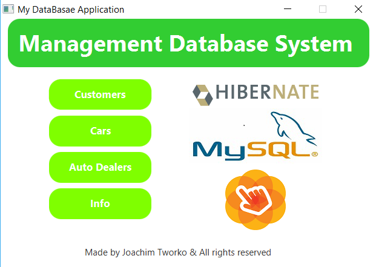
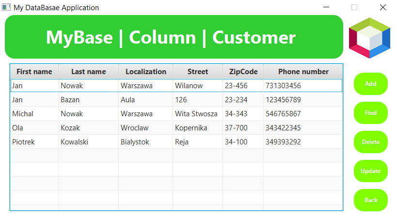
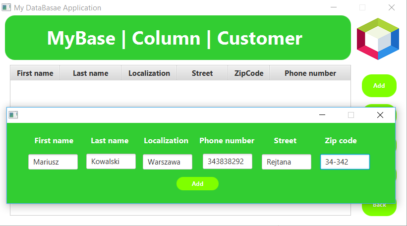

# Database Management System - DMS 

## Table of contents
* [General info](#general-info)
* [Technologies](#technologies)
* [Tools](#tools)
* [Setup](#setup)
* [Images](#images)
* [Features](#features)
* [Author](#author)

## General info
DMS is a desktop application that manages the database.
The project was created in order to pass the subject.

## Technologies
Project is created with:

* Java 8
* JavaFx
* Hibernate
* MySQL

## Tools
Environment:

* NetBeans
* MySQL Workbench

## Setup
Instructions for starting the project:

```
Download and install Netbeans from: https://netbeans.org/downloads/8.0.2/.

Attach the library to the project from: https://dev.mysql.com/downloads/connector/j/5.1.html, oraz http://hibernate.org/orm/releases/.

Connection to the base:

Download Xampp from: https://www.apachefriends.org/pl/download.html

Import the database into a localhost program and MySql database administration.

Run server Apache and MySQL for Xampp

Project is ready to run.
```
## Images

* Welcome window with options and information:




* Sample table view from the database with management options





* Adding a new record to the table





## Features

* Adding new records to tables
* Deleting records
* Update existing records

### To Do:

* Find a record after a specific column
* Adding new tables to the database
* Creating relationships between tables
* Code optimization
* Login panel

### Project status

The project is not developed, it was used for learning

## Author

* Github: https://github.com/Rybsooon11
* Linkedin: https://www.linkedin.com/in/joachim-tworko-092346176/
* Email: tworkojoachim@gmail.com


